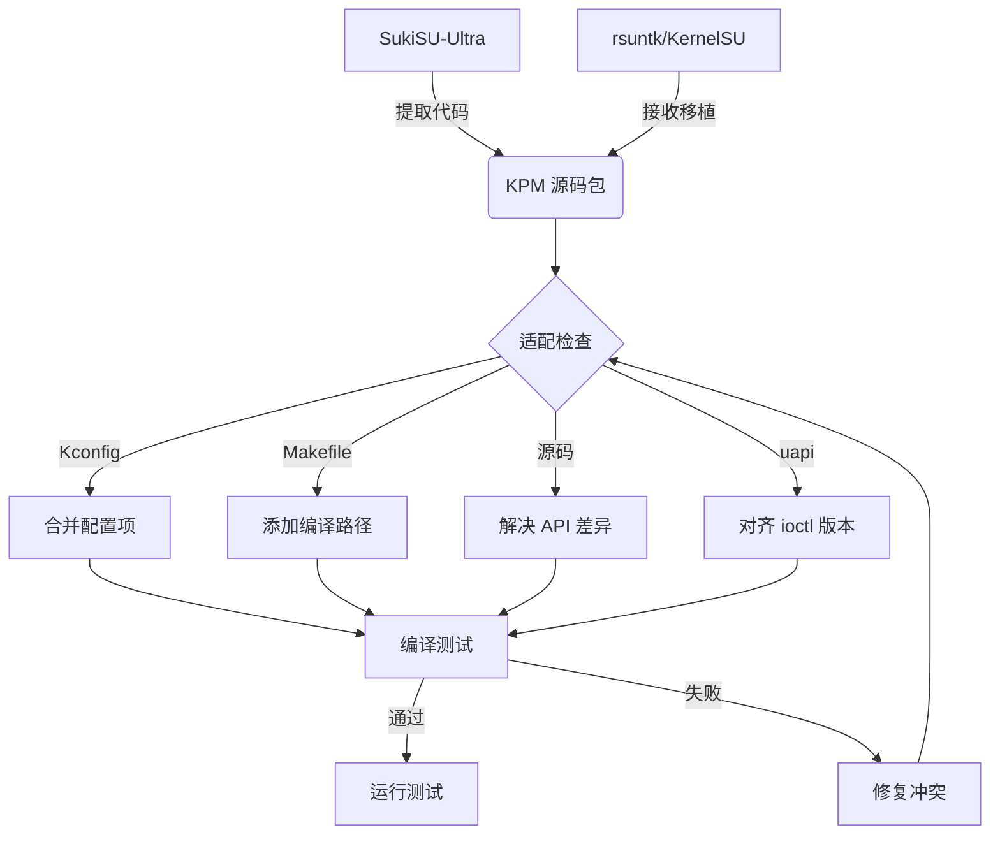

# SukiSU-Ultra vs rsuntk/KernelSU 功能合并可行性分析

## 一、KPM 详解


**KPM = Kernel Patch Module（内核补丁模块）**

KPM 是 SukiSU-Ultra 从 [KernelPatch](https://github.com/bmax121/KernelPatch) 项目移植而来的内核模块系统。它允许在内核运行时动态加载/卸载"补丁模块"，无需重新编译整个内核。


| 能力 | 说明 | 类比 |
|------|------|------|
| **Inline Hook** | 在任意内核函数入口插入跳转，劫持函数调用 | 类似 Frida 但运行在内核态 |
| **Syscall Hook** | 修改系统调用表，拦截/篡改 syscall | 比 KSU 的 manual hook 更底层 |
| **内核代码执行** | 加载任意内核代码（.kpm 模块） | 类似内核 LKM 但更轻量 |
| **运行时补丁** | 不重启内核即可应用补丁 | 类似 livepatch |


```
KernelSU（基础框架）
├── su 命令和权限管理
├── App Profile（应用配置管理）
├── 模块系统（Magisk 风格模块）
└── KPM 扩展（SukiSU-Ultra 独有）
    ├── Inline Hook 引擎 ← KernelPatch 移植
    ├── KPM 模块加载器
    ├── Syscall hook 框架
    └── 运行时内核补丁接口
```

**KPM 不是 KernelSU 的替代品，而是扩展**。KSU 处理"用户空间 root 权限管理"，KPM 处理"内核空间代码注入和执行"。


| 场景 | 解决的问题 | 是否普遍需要 |
|------|-----------|------------|
| **内核功能扩展** | 添加内核级功能（如新的系统调用） | ❌ 一般用户不需要 |
| **调试/逆向工程** | 动态分析内核行为、hook 函数调用 | ❌ 开发者专用 |
| **绕过检测** | 深度隐藏 root 痕迹（比 SUSFS 更底层） | ✅ **常见需求** |
| **热补丁** | 不重启内核修复安全问题 | ❌ 厂商场景 |
| **自定义内核模块** | 加载第三方 .kpm 内核模块 | 🔶 部分高级用户 |


| 特性 | KPM | 标准 LKM | eBPF | KSU Manual Hook |
|------|-----|---------|------|----------------|
| 内核版本要求 | 4.14+ | 无关 | 4.4+(有限) | 4.14+ |
| 动态加载 | ✅ | ✅ | ✅ | ❌ 编译时固定 |
| Inline Hook | ✅ | ❌ | ❌ | ❌ |
| Syscall Hook | ✅ | 需手动 | ❌ | ✅ 固定点 |
| 无需编译内核 | ❌ 需内核支持 | ✅ | ✅ | ❌ 需内核支持 |
| 稳定性风险 | 高 | 中 | 低 | 低 |


| 考虑维度 | 评分 | 说明 |
|---------|------|------|
| **必要性** | 🔴 低 | KSU+SUSFS 已经覆盖 root 隐藏需求 |
| **风险** | 🟡 中高 | Inline Hook 容易导致内核崩溃 |
| **维护成本** | 🔴 高 | 每个内核版本需适配 |
| **用户感知** | 🟢 低 | 一般用户不会直接使用 KPM 模块 |
| **社区模块** | 🟡 有限 | .kpm 模块生态远不如 Magisk |

**结论**：KPM 是一个高级特性，**对于一般 KSU+SUSFS 用户来说非必需**。它主要面向内核开发者、逆向工程师、以及需要深度定制的场景。

---

## 二、Cherry-pick KPM 深度解析
### 2.1 "Cherry-pick KPM" 是什么？

**Cherry-pick** 是 Git 术语，指从某个分支/仓库中**挑选特定的提交**，应用到另一个分支上。

**Cherry-pick KPM** 在本文语境中的含义：

```
源仓库：SukiSU-Ultra（提供 KPM 代码）
目标仓库：rsuntk/KernelSU（接收 KPM 代码）

具体要 cherry-pick 的内容：
① drivers/kernelsu/kpm/  ← KPM 驱动程序（~3000 行 C 代码）
② Kconfig 片段            ← CONFIG_KPM=y 的支持
③ Makefile 修改           ← 编译 kpm/ 目录
④ uapi 头文件             ← KPM 模块格式定义
⑤ Manager IPC 扩展        ← KPM 管理相关 ioctl
```

这不是 Git 的 `git cherry-pick` 命令操作（因为两个仓库不同源），而是**手动提取代码并移植**。
### 2.2 移植流程


### 2.3 Cherry-pick KPM vs SukiSU 原生 KPM：全面对比

#### 基础维度对比

| 对比维度 | Cherry-pick KPM (rsuntk) | SukiSU-Ultra 原生 KPM |
|---------|------------------------|---------------------|
| **代码来源** | 从 SukiSU 移植 | SukiSU 内置 |
| **KPM 版本** | 移植时的版本（固定） | 随 SukiSU 更新 |
| **集成深度** | 模块级集成 | **原生集成** |
| **测试充分性** | 需要自行验证 | **社区已测试** |
| **内核兼容性** | 可针对 4.19 优化 | 面向较新内核 |
| **稳定性** | ⚠️ 需自行验证 | 部分验证 |

#### 功能完整度对比

| 功能 | Cherry-pick KPM | SukiSU 原生 | 说明 |
|------|----------------|-------------|------|
| **Inline Hook** | ✅ 完整 | ✅ 完整 | 核心功能，移植完整 |
| **KPM 模块加载** | ✅ 完整 | ✅ 完整 | 文件格式一致 |
| **Syscall Hook** | ⚠️ 需适配 | ✅ 原生 | syscall 表位置可能不同 |
| **Manager 集成** | ⚠️ 需 SukiSU Manager | ✅ 完整 | Manager ioctl 需对应 |
| **热卸载** | ✅ 相同 | ✅ 相同 | 核心机制一致 |
| **KPM 模板兼容** | ✅ 兼容 | ✅ 兼容 | .kpm 二进制格式标准 |
| **错误处理** | ⚠️ 需测试 | ✅ 较完善 | edge case 处理可能缺 |
| **多版本兼容** | ❌ 单一版本 | ✅ 持续更新 | SukiSU 会跟进上游 |

#### 代码质量对比

| 维度 | Cherry-pick KPM | SukiSU 原生 |
|------|----------------|-------------|
| **代码成熟度** | 中（静态版本） | 高（持续演进） |
| **Bug 修复** | ❌ 需手动跟进 | ✅ 自动获得更新 |
| **4.19 适配** | ✅ 可自定义适配 | ⚠️ 需兼容补丁 |
| **代码冗余** | 低（仅搬必要部分） | 中（含 SukiSU 特有依赖） |
| **可维护性** | 低（需手动合并更新） | 高（上游维护） |

#### 性能对比

| 指标 | Cherry-pick KPM | SukiSU 原生 |
|------|----------------|-------------|
| **Hook 延迟** | 相同 | 相同 |
| **内存占用** | 相同（约 50KB） | 相同 |
| **CPU 开销** | 相同（仅被 hook 的函数有开销） | 相同 |
| **启动时间** | 可能更短（无多余初始化） | 略长（完整框架初始化） |
### 2.4 谁更强？结论

| 场景 | 强者 | 理由 |
|------|------|------|
| **功能完整性** | **SukiSU 原生** ✅ | 持续更新、社区测试充分 |
| **4.19 兼容性** | **Cherry-pick** ✅ | 可针对 4.19 做定制适配 |
| **稳定性** | **持平** | KPM 核心代码相同 |
| **长期维护** | **SukiSU 原生** ✅ | 上游自动跟进 |
| **移植到 rsuntk** | **Cherry-pick** ✅ | SukiSU 原生不在 rsuntk 上 |
| **对 OnePlus 8T 适配** | **Cherry-pick** ✅ | 可精细化控制 |

**综合结论：**
- **如果只看功能本身**：SukiSU 原生 KPM 更强（持续更新、生态完善）
- **如果看 rsuntk 上的可用性**：Cherry-pick KPM 是唯一选择（SukiSU 原生不在 rsuntk 上）
- **最合理策略**：先用 rsuntk 纯版跑通基础，若确实需要 KPM 再 cherry-pick，不要提前做
### 2.5 决策建议

```
是否有必要做 Cherry-pick KPM？
│
├─ 当前是否有已知的 KPM 模块需求？
│  ├─ 有（比如某个 root 隐藏模块需要 KPM）
│  │  └─ ✅ 做 Cherry-pick
│  │
│  └─ 没有（SUSFS 已满足隐藏需求）
│     └─ ❌ 不做，集中精力让基础 KSU 跑通
│
└─ 将来可能需要？
   └─ 保留 KPM 源码，需要时再移植
```
### 2.6 Cherry-pick KPM 的具体文件清单

从 SukiSU-Ultra 到 rsuntk 需要移植的文件：

```
# 内核驱动（必须）
drivers/kernelsu/kpm/
├── core/              # KPM 核心引擎
│   ├── kpm.c          # 主模块加载器
│   ├── kpm.h          # 内部头文件
│   ├── kpm_elf.c      # .kpm ELF 解析器
│   └── kpm_elf.h
├── kpm_module.c        # KPM 模块接口
├── kpm_module.h
├── kpm_selftest.c      # 自检（可选）
└── Makefile

# uapi（必须，用户空间接口）
include/uapi/linux/kpm.h     # KPM ioctl 命令定义

# Kconfig（必须）
Kconfig 中 CONFIG_KPM 选项定义

# Manager 接口（可选，如需要 Manager 管理 KPM）
manager/
├── src/main/java/.../kpm/    # KPM 管理界面
└── res/layout/kpm_dialog.xml # KPM 弹窗
```

---

## 三、Manager 详解
### 3.1 什么是 Manager？

**Manager = KernelSU Manager（KSU 管理器应用）**

这是一个安装在 Android 系统中的 APK，用户通过它与内核中的 KSU 驱动交互。它是 KSU 的用户空间界面。
### 3.2 Manager 管理的功能

| 功能模块 | 说明 |
|---------|------|
| **Root 授权管理** | 弹出 root 请求弹窗、管理应用 root 权限（允许/拒绝/超时） |
| **模块管理** | 安装/卸载/启用/禁用 KSU 模块（类似 Magisk 模块） |
| **App Profile** | 应用配置文件：限制某个应用的 root 使用范围 |
| **SUSFS 管理** | 启用/禁用 SUSFS 隐藏功能（SukiSU Manager 独有） |
| **日志查看** | 查看 root 授权日志、SUSFS 操作日志 |
| **主题/外观** | **SukiSU 独有**：自定义管理器主题 |
| **命名空间** | 管理 Mount Namespace（Unshare） |
| **版本信息** | 显示 KSU 内核版本、管理器版本 |
### 3.3 Manager 的实现方式

Manager 通过 `/dev/ksu`（或类似字符设备）与内核中的 KSU 驱动通信：

```
KSU Manager (用户空间 APK)
        │
        ├── ioctl() → /dev/ksu → KSU 内核驱动
        ├── SQLite DB → 应用权限数据库
        └── WebUI → SUSFS 状态/配置界面
```
### 3.4 SukiSU Manager 的独有功能

| 功能 | SukiSU Manager | rsuntk Manager |
|------|---------------|----------------|
| **SUSFS 内置管理** | ✅ WebUI 直接控制 | ❌ 需独立工具 |
| **主题自定义** | ✅ 多主题/动画 | ❌ 固定主题 |
| **KPM 模块管理** | ✅ 加载/卸载 .kpm | ❌ 不支持 |
| **日志增强** | ✅ SUSFS 操作日志 | ❌ 基础日志 |
| **本地化** | ✅ 多语言 | ✅ 多语言 |

---

## 四、SukiSU ↔ rsuntk 合并可行性分析
### 4.1 代码结构对比

```
KernelSU 基础结构：
drivers/kernelsu/
├── core/          ← KSU 核心（通用）
├── feature/       ← 特性模块（通用）
├── hook/          ← Hook 机制（不同 fork 差异大）
├── kpm/           ← KPM（仅 SukiSU 有）
├── manager/       ← 管理器 IPC（通用）
├── selinux/       ← SELinux 处理（通用）
├── supercall/     ← SUSFS 系统调用（差异大）
└── Kconfig        ← 编译配置（差异大）
```

**关键发现**：KPM 是独立目录（`drivers/kernelsu/kpm/`），与核心 KSU 代码耦合度低。这意味着它可以相对容易地移植到其他 fork 上。
### 4.2 合并难度评估

| 要合并的特性 | 代码量 | 耦合度 | 难度 | 预计工作量 |
|------------|--------|--------|------|-----------|
| **KPM 驱动** | ~3000 行 C | 低 | 🟡 中 | 2-3 天 |
| **KPM Manager 接口** | ~500 行 | 低 | 🟢 低 | 半天 |
| **Manager 主题** | ~2000 行 Kotlin | 独立 | 🟢 低 | 半天 |
| **SUSFS 管理 WebUI** | ~1000 行 JS | 中 | 🟡 中 | 1 天 |
| **SUSFS Supercall** | ~4000 行 C | 高 | 🔴 高 | 1 周 |
### 4.3 合并方案对比

#### 方案 A：rsuntk 基础 + Cherry-pick KPM（推荐）

```
步骤：
1. Fork rsuntk/KernelSU
2. 从 SukiSU 复制 drivers/kernelsu/kpm/ → rsuntk
3. 复制 KPM 相关 Kconfig/Makefile 修改
4. 复制 kpm uapi 头文件
5. 编译测试
6. 可选：替换 Manager APK
```

**优点**：
- rsuntk 的 non-GKI 稳定性不变
- KPM 是低耦合模块，不易引入冲突
- 维护简单（只关注 KPM 目录的更新）

**缺点**：
- 需要关注 KPM 与 rsuntk hook 机制的潜在交互
- 如果 KPM 更新了 inline hook 内核 API，需同步

#### 方案 B：SukiSU builtin + rsuntk 兼容补丁

```
步骤：
1. 使用 SukiSU-Ultra builtin 分支
2. 从 rsuntk cherry-pick 4.19 兼容性修复
3. 应用所有 4.19 backport
```

**优点**：
- KPM 默认已有
- 管理器默认是 SukiSU

**缺点**：
- builtin 分支的 SUSFS 版本不匹配问题仍在
- 需要大量 4.19 兼容补丁（我们已经做了 10+ 轮）
- **这是我们现在正在做的，卡住了**

#### 方案 C：使用 larrypaul93 仓库作为中间层

```
步骤：
1. Fork larrypaul93/oneplus8-kernelsu-susfs
2. 它已支持 SukiSU + SUSFS + 正确 hook 配置
3. 在此基础上 cherry-pick rsuntk 的优化
4. 管理器默认就是 SukiSU Manager
```

**优点**：
- 已经验证可以在 OnePlus 8T 上工作
- 包含了 SukiSU 生态
- 减少重复劳动

**缺点**：
- 依赖 larrypaul93 的维护
- 需要学习其构建流程
### 4.4 最终建议

| 优先级 | 行动 | 理由 |
|--------|------|------|
| **P0** | **让内核先跑起来** | 无论用哪个 fork，必须先有一个编译通过、启动正常的 KSU 内核 |
| **P1** | 验证 rsuntk 能否成功编译启动 | 如果 rsuntk 能一次成功，这就是基础 |
| **P2** | 启动成功后，评估是否需要 KPM | 大多数用户不需要 KPM（SUSFS 已覆盖隐藏需求） |
| **P3** | 如果确实需要 KPM，用方案 A cherry-pick | 低耦合、风险可控 |
| **P4** | 替换 Manager APK | 最独立的部分，最后一个做 |

---

## 五、KPM 详细技术分析
### 5.1 KPM 的实现原理

KPM 基于 KernelPatch 的核心机制——**Inline Hook**：

```
原始函数:
  func_a:
    mov x0, #0    ← 函数入口
    ret

被 KPM Hook 后:
  func_a:
    ldr x1, [pc]  ← 5 字节跳板
    br x1
    .8byte hook_handler
```

KPM 在目标函数入口写入一条无条件跳转指令，跳转到 KPM 模块的处理函数。处理函数执行完毕后可以选择：
- 跳回原函数继续执行
- 修改参数/返回值
- 完全不执行原函数
### 5.2 KPM 模块结构

一个 `.kpm` 模块就是一个经过特殊格式化的 ELF 文件：

```c
// kpm_module.c - 一个简单的 KPM 模块示例
#include <kpm/kpm.h>

// Hook 点：劫持 sys_open
static asmlinkage long (*real_sys_open)(const char __user *, int, umode_t);

static asmlinkage long hooked_sys_open(const char __user *filename, int flags, umode_t mode)
{
    // 检查文件名，如果是敏感文件则拦截
    if (strstr(filename, "/data/adb") != NULL)
        return -ENOENT;
    return real_sys_open(filename, flags, mode);
}

// 模块初始化
int kpm_module_init(void)
{
    // 查找 sys_open 函数地址
    void *addr = kallsyms_lookup_name("__arm64_sys_open");
    // 安装 hook
    real_sys_open = addr;
    kpm_install_hook(addr, hooked_sys_open);
    return 0;
}
```
### 5.3 KPM 限制

| 限制 | 说明 | 对我们的影响 |
|------|------|------------|
| 内核 4.19+ | 低于 4.19 需 backport set_memory.h | 我们就是 4.19 ✅ |
| CONFIG_KPM=y | 必需 | 我们已启用 ✅ |
| KALLSYMS | 符号查找必需 | 我们已启用 ✅ |
| 内核文本段可写 | 某些内核需禁用 WXN | 需检查 defconfig |
| ARM64 兼容 | KPM 对 ARM64 支持较好 | 我们是 ARM64 ✅ |

---

## 六、Manager 详细技术分析
### 6.1 Manager 的通信协议

Manager 通过 `/dev/ksu` 字符设备使用 `ioctl` 与内核通信：

```c
// 关键 ioctl 命令
#define KSU_IOCTL_ALLOW_SU      _IOW('k', 1, struct ksu_request_data)
#define KSU_IOCTL_DENY_SU       _IOW('k', 2, struct ksu_request_data)
#define KSU_IOCTL_GET_APPS      _IOR('k', 3, struct ksu_app_info)
#define KSU_IOCTL_GRANT_ROOT    _IOW('k', 10, __u32)  // SukiSU 扩展
#define KSU_IOCTL_KPM_LOAD      _IOW('k', 20, char*)  // SukiSU 扩展
```

两个 fork 的基础 ioctl 命令是兼容的，但 SukiSU 增加了扩展命令（如 KPM 加载、SUSFS 管理）。这是管理器互换性的关键——**SukiSU Manager 可以连接 rsuntk 内核（基础功能），但 KPM/SUSFS 管理功能需要内核支持**。
### 6.2 Manager 的互换性

| 内核 | Manager | 兼容性 |
|------|---------|--------|
| rsuntk | rsuntk Manager | ✅ 完全兼容 |
| rsuntk | SukiSU Manager | ✅ 基础功能正常，KPM/SUSFS 管理不可用 |
| SukiSU | rsuntk Manager | ✅ 基础功能正常 |
| SukiSU | SukiSU Manager | ✅ 完全兼容 |

**结论**：Manager 可以独立于内核 fork 更换，基础 root 管理功能互通。高级功能（KPM 管理、SUSFS WebUI）需要对应内核支持。

---

## 七、决策树

```
当前问题：4 个 KernelSU fork 怎么选？
│
├─ 首要目标：在 OnePlus 8T 4.19 上跑通 KSU+SUSFS
│  │
│  ├─ rsuntk/KernelSU ← 最稳、non-GKI 首选
│  │    ├─ 编译能否通过？ → 测试中
│  │    └─ 启动能否成功？ → 待验证
│  │
│  └─ larrypaul93 ← 已验证 OnePlus 8T
│       └─ 直接 fork，改内核源即可
│
├─ 次要目标：是否需要 KPM？
│  ├─ 需要 → 方案 A (rsuntk + cherry-pick KPM)
│  └─ 不需要 → 直接用 rsuntk 即可
│
└─ 最终目标：SukiSU Manager 界面
   ├─ 独立于内核，最后单独替换 APK
   └─ 即使内核是 rsuntk，也能装 SukiSU Manager
```

---

## 八、总结

| 项目 | 结论 |
|------|------|
| **能否合并 KPM 到 rsuntk？** | ✅ 技术上可行，KPM 是低耦合模块，预计 2-3 天工作量 |
| **能否换 SukiSU Manager？** | ✅ Manager 与内核 fork 无关，基础功能互通 |
| **KPM 是什么？** | 内核补丁模块系统，支持运行时 Inline Hook |
| **KPM 有必要吗？** | ❌ 一般用户不需要，SUSFS 已覆盖隐藏需求 |
| **当前首选方案？** | 先验证 rsuntk/KernelSU 能否编译启动，再决定是否加 KPM |
